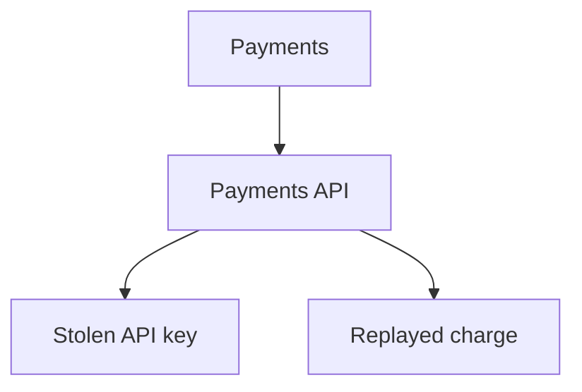

- Payments
  - Payments API
    - Stolen API key
    - Replayed charge

```mermaid
flowchart TD
    n1["Payments"]
    n2["Payments API"]
    n3["Stolen API key"]
    n4["Replayed charge"]
    n1 --> n2
    n2 --> n3
    n2 --> n4
```
